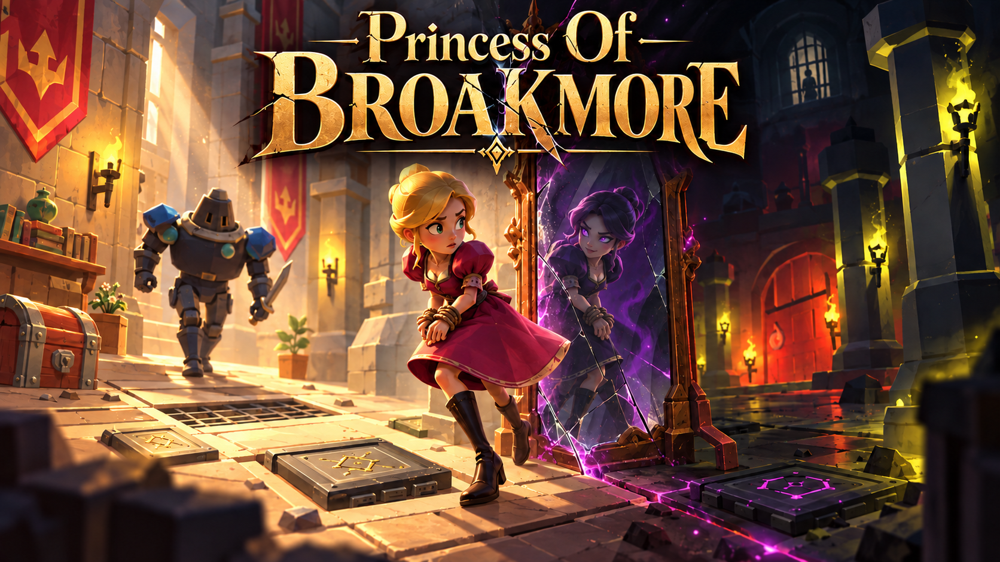

# Princess of Broakmore



**Two sides of the same castle. One chance to escape.**

A 3D puzzle and stealth adventure prototype built by a student team for **Project Kickstart at Saxion University of Applied Sciences**, in September 2025. Step through mirrors, connect paths of light, and navigate two realities to escape a guarded castle.

**Unity 6 · C# · Universal Render Pipeline · Academic prototype · Team P6**

<p align="center">
  <a href="https://www.youtube.com/watch?v=k2pmQBuVHO8">
    
  </a>
  <br>
  <a href="https://www.youtube.com/watch?v=k2pmQBuVHO8">▶ Watch the project video</a>
</p>

[Getting started](#getting-started) · [Meet the team](#team)

## Why we built it

We joined Project Kickstart as a group of Saxion students with a shared challenge: turn an interactive product idea into a working prototype and a convincing pitch. The assignment brought together development, art, design, and market research, asking us to think about both the player experience and the project's potential as a product.

The project included a competitive selection for **Saxion's Dragons’ Den**, where selected teams would pitch their ideas to industry professionals. We developed Princess of Broakmore within that setting, preparing a pitch, promotional materials, and a demonstration of its core mechanics.

With an expected workload of three full-time weeks per team member, the goal was a **vertical slice**: a small sample of the intended experience that could communicate the game's identity and potential. This repository preserves that academic prototype.

## The story

A princess is imprisoned in the highest tower of a castle, her hands bound. To escape, she must navigate guarded corridors, unlock doors, and solve puzzles without being discovered.

But Broakmore has a secret: its mirrors lead to another reality. On the other side, the same castle becomes a sinister place, and the princess takes on a darker personality. Crossing a mirror changes her surroundings, but it does not free her from the castle.

Escape means bringing together clues and possibilities from both worlds. Light, platforms, and objects take on new roles with each crossing. Even the guards change: in the dark reality, their bodies disappear and only their shadows remain, keeping their presence in the world.

<details>
<summary><strong>Story spoilers: the planned ending</strong></summary>

After finally escaping, the princess would discover that the castle was her perception of a psychiatric institution. In the original story concept, the protagonist lives with schizophrenia, and the adventure unfolds through her perception of reality. The reveal reframes the mirrors, her imprisonment, and the escape itself.

This ending belongs to the narrative concept; it is not presented here as a completed ending sequence in the prototype.

</details>

## Puzzles and exploration

### Flowers and paths of light

In the bright reality, stepping on specific stones and platforms changes the direction of light and the connections between flowers. The player must build a continuous path to a door to unlock it. The visual concept is to guide sunlight through the flowers; the implementation represents this path through light sources, targets, and connections between objects.

### Totems in the dark dimension

Beyond the mirror, platforms rotate columns or totems. Aligning their connections and lighting the required torches releases a box. The team's intended gameplay sequence uses this box to carry light to a door and open an escape route, while the guard keeps the player under pressure.

### Mirrors, guards, and physical interaction

- **Mirrors:** switch between the two versions of the castle when approached, with a cooldown between crossings.
- **Guards:** patrol the environment, detect the princess, and chase or charge at her.
- **Physical objects:** boxes can be pushed; a scream/blow action applies an impulse to nearby objects.
- **Two realities:** visibility, lighting, and the availability of puzzle elements change with the active dimension.

## Technical overview

| Technology | Recorded version / purpose |
| --- | --- |
| Unity | **6000.0.42f1** (Unity 6) |
| C# | Gameplay, movement, puzzles, audio, and state management |
| Universal Render Pipeline | **17.0.4**, project rendering pipeline |
| AI Navigation | **2.0.6**, guard navigation with `NavMeshAgent` |
| Input System | **1.13.1** installed; the inspected gameplay scripts also use `UnityEngine.Input`, with input handling set to **Both** |
| Unity UI and Animator | Interfaces and character animations |

The main systems live in [`Project Kickstart/Assets/Scripts`](Project%20Kickstart/Assets/Scripts):

| System | Implementation |
| --- | --- |
| Dimensions | [`DimensionManager`](Project%20Kickstart/Assets/Scripts/Dimension/DimensionManager.cs) holds global dimension state and publishes `OnDimensionChanged` and `OnDimensionSwitched` events. Dimension components respond to those changes. |
| Mirrors | [`Mirror`](Project%20Kickstart/Assets/Scripts/Mechanics/Mirror.cs) checks proximity, applies a cooldown, and requires the player to leave its area before crossing again. |
| Flowers and doors | [`Platform`](Project%20Kickstart/Assets/Scripts/Platform.cs), [`Flower`](Project%20Kickstart/Assets/Scripts/Flower.cs), [`Torch`](Project%20Kickstart/Assets/Scripts/Torch.cs), and [`Door`](Project%20Kickstart/Assets/Scripts/Door.cs) build the light path. Doors validate the complete sequence, with protection against circular connections. |
| Totems | [`ColumnPuzzleManager`](Project%20Kickstart/Assets/Scripts/Puzzles/ColumnPuzzleManager.cs) checks four columns, their rotations, and lit torches in the required dimension, then activates or spawns the reward box. |
| Movement | [`Movement2`](Project%20Kickstart/Assets/Scripts/Movement/Movement2.cs) uses a `Rigidbody`, acceleration, braking, and gradual rotation, while updating the character's animation. |
| Guards | [`GuardMovement`](Project%20Kickstart/Assets/Scripts/Movement/GuardMovement.cs) and [`GuardMovementCharge`](Project%20Kickstart/Assets/Scripts/Movement/GuardMovementCharge.cs) implement patrol, attack/chase, and return states, with a view radius, viewing angle, and obstacle checks. The former also synchronizes a shadow's position. |
| Physics interaction | [`ObjectPusher`](Project%20Kickstart/Assets/Scripts/ObjectPusher.cs) and [`BlowController`](Project%20Kickstart/Assets/Scripts/Mechanics/BlowController.cs) handle object movement and impulses applied to nearby boxes. |
| Audio and progression | [`AudioManager`](Project%20Kickstart/Assets/Scripts/Audio/AudioManager.cs) centralizes sound effects; [`PhaseManager`](Project%20Kickstart/Assets/Scripts/PhaseManager.cs) handles transitions between areas and camera positions. |

### Project structure

```text
Project Kickstart/
├── Assets/
│   ├── Scenes/          # Menu, main level, and experimental scenes
│   ├── Scripts/
│   │   ├── Audio/
│   │   ├── Dimension/
│   │   ├── Mechanics/
│   │   ├── Movement/
│   │   └── Puzzles/
│   └── Hanzzz/          # Third-party MeshDemolisher component
├── Packages/            # Unity dependencies
└── ProjectSettings/     # Editor version and project configuration
docs/images/             # Artwork used in this README
```

## Getting started

1. Install **Unity Hub** and **Unity Editor 6000.0.42f1**.
2. Clone this repository:

   ```bash
   git clone https://github.com/YagoDevs/PrincessOfBroakmore.git
   ```

3. In Unity Hub, add **`PrincessOfBroakmore/Project Kickstart`** as a project.
4. Wait for Unity to import assets and resolve packages.
5. Open **`Assets/Scenes/Interfaces.unity`**, enter **Play Mode**, and start the game from the menu. To explore the main level directly, open **`Assets/Scenes/dugeon.unity`**; `dugeon` is the spelling used in the project.

To create a build, open **File → Build Profiles**, select your target platform, and check the scene list: `Interfaces` first, followed by `dugeon`. Install the corresponding platform build module through Unity Hub if needed.

### Controls

| Input | Action in the prototype scripts |
| --- | --- |
| **W, A, S, D** | Move the princess |
| **Approach a mirror** | Switch dimensions |
| **Step on platforms** | Activate puzzle elements |
| **F** | Scream/blow to push nearby boxes |
| **R** | Restart the current scene when `GameManager` is active |
| **Tab** | Direct dimension switching available in `DimensionManager` |

Configurable shortcuts and interactions depend on the active components and Inspector references in each scene. Jumping is commented out in the current movement controller.

### Prototype status

This documentation was checked against the source code and project settings; a complete Unity playthrough was not performed for this documentation update. The repository includes test scenes and alternative implementations developed during the project. The story describes the team's narrative vision, while the technical overview describes systems present in the source.

## Team

**Group P6 · Saxion · September 2025**

| Team member | Role recorded in the progress presentation |
| --- | --- |
| Ana | Design / 2D Art |
| Gregoire | 2D / 3D Art |
| Jaime | Design / “CEO of Bugs” |
| Marie | Design / Engineering |
| Léo | Gameplay Mechanics Engineering |
| David | Design / Engineering |
| Yago | Gameplay Mechanics Engineering |

The team worked on mechanics, level design, animations, textures, visual identity, and promotional materials. We used **Trello, Miro, Discord, GitHub, and Drive** to coordinate development and share work.

Our progress presentation also recorded what we learned: adapting to different working styles, improving communication, and establishing a better Git workflow. The prototype was a shared learning experience across art, design, and engineering.

### History and acknowledgements

This independent repository preserves the Git history of the project originally developed in `leowht/DragonsDen` and maintained in the `YagoDevs/Princess-of-broakmore` fork. Earlier commits retain their original hashes, authors, dates, and merges. Team credits also recognize art and design contributions that may not appear as commit authorship.

The progress presentation used the working title **“Prisoner of Broakmore”**; the cover artwork and this repository use **“Princess of Broakmore.”**

Academic context and team roles were checked against **“Kick off project Kickstart 2526”** and **“Dragons Den Progress.”** The project includes third-party code such as [MeshDemolisher](Project%20Kickstart/Assets/Hanzzz/MeshDemolisher/README.md), whose credits should be retained. No repository-wide license is currently defined at the root.
